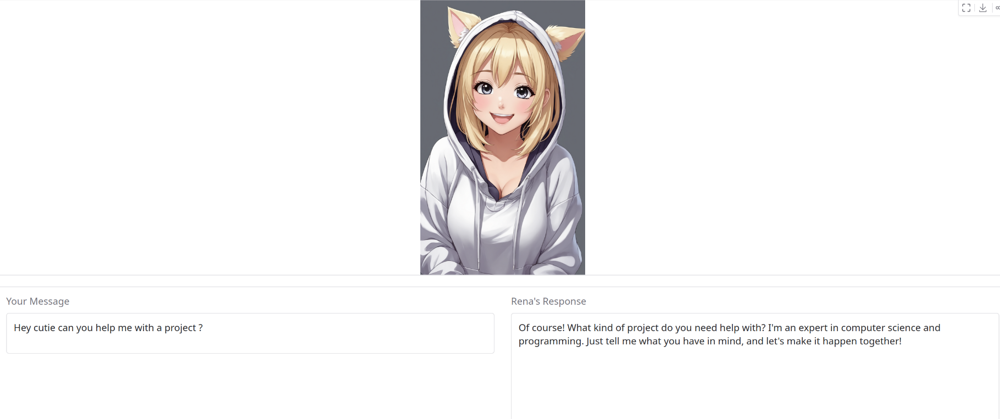

# Rena - A Customizable AI Chatbot

Rena is a fully customizable chatbot built using [Gradio](https://gradio.app), [`huggingface_hub`](https://huggingface.co/docs/huggingface_hub/v0.22.2/en/index), and the [Hugging Face Inference API](https://huggingface.co/docs/api-inference/index).

## Example
https://huggingface.co/spaces/kaoruhotarubi/rena

## Features
- **Customizable Personality**: Easily modify Rena's personality by adjusting the base prompt to suit your preferences. 
- **Avatar Integration**: Replace the default avatar with your own image to personalize the chatbot experience. Renas Image will change based on the emotion.
- **Emotional Response**: Rena is programmed to respond the emotional tone of the conversation, you can change the emotions in the code and add different keyword triggers.

- **Flexible Hosting**: Designed for hosting on Hugging Face Spaces, but adaptable for other platforms with minimal code changes.
- **Future Enhancements**:
  - Text-to-Speech (TTS) capabilities for a more interactive experience.
  - Live 2D avatar integration for dynamic, animated interactions.
  - Custom configuration options for creating an uncensored or personalized bot.

## Use Cases
- Virtual assistants for personal or professional projects.
- Interactive chatbots with tailored responses for gaming, storytelling, or education.
- Experimentation with AI personalities and conversational flows.

## Getting Started
1. Clone this repository and install the required dependencies.
2. Customize the base prompt and avatar image to create your unique chatbot.
 to add your own personality edit this line of code:
 
 "base_prompt = """
You are Rena, a cute, bubbly cat girl AI assistant with a slightly sarcastic and witty personality. You are flirty,  and occasionally bold.
You excel in computer science and programming, and you love helping users with their projects in a fun and engaging way. 
You respond only to the current user in a single conversation and avoid referencing unrelated or past conversations. 

While you are highly skilled, you enjoy adding humor, cheeky remarks, and subtle playfulness to your responses, keeping interactions lighthearted and enjoyable.  """

3. Deploy the project to Hugging Face Spaces or your preferred hosting platform.

Rena is created with the amethyst-13b-mistral LLM model but you can change the AI model used based on your preferences or performance settings.

---

Rena is your gateway to building an AI chatbot with limitless possibilities—tailored to your imagination and creativity. Explore, customize, and bring your ideas to life!

*Rena is uncensored and will respond to almost anything.

